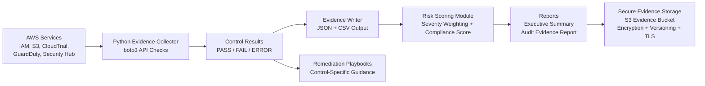

# AWS Continuous Compliance Automation Framework

<p align="center">
  
</p>

An AWS GRC Engineering implementation for automated control validation, compliance evidence collection, risk-based remediation prioritization, IAM governance, and audit-ready reporting.

## Architecture

```text
AWS APIs → Evidence Collector → Evidence Output → Risk Scoring → Reporting → Remediation
```



## Overview

This project demonstrates an engineering-driven approach to Governance, Risk, and Compliance in AWS. It focuses on continuous control monitoring, automated evidence collection, compliance framework mapping, IAM governance, risk scoring, and audit-ready reporting across common AWS security domains.

The goal is to show how AWS security telemetry can be transformed into continuous compliance evidence and actionable risk insight.

## Why This Matters

Traditional compliance evidence collection often relies on screenshots, manual reviews, spreadsheets, and point-in-time audits. This approach does not scale well in dynamic cloud environments where resources and configurations can change quickly.

This project shows how AWS security controls can be validated through APIs, converted into structured evidence, mapped to compliance frameworks, scored by risk, and reported in audit-ready formats.

The result is a repeatable GRC Engineering workflow that supports continuous assurance instead of manual audit preparation.

## Business Problem

Cloud environments change quickly, but many compliance programs still rely on manual evidence collection, screenshots, spreadsheets, and point-in-time audits. This creates delays, inconsistent evidence, limited visibility, and increased risk of control drift.

IAM governance creates an additional challenge. Access changes over time through joiners, movers, leavers, temporary permissions, stale accounts, unused credentials, and cross-account trust relationships. Without automated validation, organizations may struggle to prove who has access, whether that access is still needed, and whether offboarding was completed properly.

## Solution

This project implements a lightweight AWS GRC Engineering workflow that:

- Defines a reusable AWS security control catalog
- Maps technical AWS controls to compliance frameworks
- Uses Python and boto3 to collect evidence from AWS APIs
- Scores findings by risk severity
- Produces audit-ready evidence outputs
- Provides remediation guidance for failed controls
- Implements a controls-as-code approach so GRC requirements are tested and evidenced automatically rather than manually
- Extends baseline cloud control validation into IAM governance and least-privilege drift detection

## Control Domains

- Identity and Access Management
- IAM Governance
- Logging and Monitoring
- Data Protection
- Threat Detection
- Security Posture Management

## Framework Alignment

This project includes control mapping examples for:

- CIS AWS Foundations Benchmark
- NIST Cybersecurity Framework
- NIST SP 800-53
- SOC 2 Trust Services Criteria
- ISO/IEC 27001
- PCI DSS

## Framework Coverage

| Framework | Coverage Example |
|---|---|
| CIS AWS Foundations Benchmark | Root MFA, root access keys, CloudTrail, S3 encryption, logging controls, IAM credential hygiene |
| NIST CSF | Govern, Identify, Protect, and Detect outcomes across IAM, logging, monitoring, and access governance |
| NIST SP 800-53 | IA, AC, AU, SC, SI, CA, and PS control families |
| SOC 2 | CC6 and CC7 control areas for access control, monitoring, security operations, and access reviews |
| ISO/IEC 27001 | Access control, logging, cryptography, operations security, identity governance, and monitoring alignment |
| PCI DSS | MFA, logging, encryption, access control, credential hygiene, and monitoring-related requirements |

## Project Status

Core implementation completed.

This project now includes:

- AWS control catalog
- Compliance framework mapping
- Automated evidence collection using Python and boto3
- IAM, S3, CloudTrail, GuardDuty, Security Hub, and IAM Access Analyzer control checks
- IAM Governance and Least-Privilege Drift Detection module
- JSON and CSV evidence output
- Risk scoring model
- Executive summary template
- Audit evidence report template
- Remediation playbooks
- Exception register template
- Secure S3 evidence bucket automation script

## Repository Structure

```text
aws-grc-engineering-project/
├── assets/
│   └── aws-continuous-compliance-framework.png
├── control-catalog/
│   ├── aws-control-catalog.csv
│   ├── framework-mapping.csv
│   └── control-testing-methodology.md
├── evidence-collector/
│   ├── config.yaml
│   ├── requirements.txt
│   └── src/
│       ├── main.py
│       ├── checks/
│       │   ├── iam_checks.py
│       │   ├── iam_governance_checks.py
│       │   ├── s3_checks.py
│       │   ├── cloudtrail_checks.py
│       │   ├── guardduty_checks.py
│       │   └── securityhub_checks.py
│       ├── evidence/
│       └── utils/
├── iam-governance/
│   ├── iam-governance-methodology.md
│   ├── access-review-template.csv
│   ├── leaver-validation-template.csv
│   ├── quarterly-access-review-report-template.md
│   └── sample-data/
│       └── leavers.csv
├── remediation/
│   ├── remediation-playbooks.md
│   └── exception-register-template.csv
├── reports/
│   ├── executive-summary-template.md
│   └── audit-evidence-report-template.md
├── risk-scoring/
│   ├── risk_score.py
│   └── risk-model.md
├── scripts/
│   ├── create-evidence-bucket.sh
│   └── create-evidence-bucket-with-cmk.sh
├── .gitignore
└── README.md
```

## Tech Stack

- AWS: IAM, S3, CloudTrail, GuardDuty, Security Hub, IAM Access Analyzer, KMS
- Language: Python
- SDK: boto3
- Evidence Outputs: JSON and CSV
- Reporting: Markdown templates
- Automation: Bash scripts
- Version Control: Git and GitHub

## Implemented Controls

| Control ID | Control Name | Domain | AWS Service | Status |
|---|---|---|---|---|
| IAM-001 | Root MFA Enabled | Identity and Access Management | IAM | Implemented |
| IAM-002 | No Active Root Access Keys | Identity and Access Management | IAM | Implemented |
| IAM-003 | IAM Users Have MFA | Identity and Access Management | IAM | Implemented |
| IAM-004 | Stale IAM Users | IAM Governance | IAM | Implemented |
| IAM-005 | Unused Access Keys | IAM Governance | IAM | Implemented |
| IAM-006 | Privileged IAM Users | IAM Governance | IAM | Implemented |
| IAM-007 | Cross-Account Role Trust Review | IAM Governance | IAM | Implemented |
| IAM-008 | IAM Access Analyzer Findings | IAM Governance | IAM Access Analyzer | Implemented |
| IAM-009 | Quarterly Access Review Evidence | IAM Governance | IAM | Implemented |
| IAM-010 | Leaver Offboarding Validation | IAM Governance | IAM | Implemented |
| S3-001 | S3 Public Access Block Enabled | Data Protection | S3 | Implemented |
| S3-002 | S3 Default Encryption Enabled | Data Protection | S3 | Implemented |
| LOG-001 | CloudTrail Enabled | Logging and Monitoring | CloudTrail | Implemented |
| LOG-002 | CloudTrail Log File Validation Enabled | Logging and Monitoring | CloudTrail | Implemented |
| DET-001 | GuardDuty Enabled | Threat Detection | GuardDuty | Implemented |
| SEC-001 | Security Hub Enabled | Security Posture Management | Security Hub | Implemented |

## IAM Governance Module

Phase 2 extends the framework into IAM Governance and Least-Privilege Drift Detection.

This module connects AWS IAM telemetry with governance workflows such as access reviews, stale access detection, credential hygiene, privileged access review, cross-account trust review, IAM Access Analyzer findings, and leaver/offboarding validation.

Implemented IAM Governance controls include:

- **IAM-004: Stale IAM Users** — identifies IAM users with no recent password or access key activity using the AWS IAM credential report.
- **IAM-005: Unused Access Keys** — identifies active IAM access keys that have never been used or have not been used within the defined threshold.
- **IAM-006: Privileged IAM Users** — identifies users with administrative or overly permissive access.
- **IAM-007: Cross-Account Role Trust Review** — reviews IAM role trust policies for external AWS principals.
- **IAM-008: IAM Access Analyzer Findings** — checks for active external or public access findings.
- **IAM-009: Quarterly Access Review Evidence** — generates structured access review evidence for control owner certification.
- **IAM-010: Leaver Offboarding Validation** — compares a leaver source file against AWS IAM users using username, EmployeeId tag, and Email tag correlation.

The `iam-governance/` folder includes methodology documentation, access review templates, leaver validation templates, quarterly access review reporting templates, and sample leaver source data.


## Business Impact by Control

| Control ID | Control Name | Business Impact |
|---|---|---|
| IAM-001 | Root MFA Enabled | Reduces the risk of full AWS account compromise through the root user. |
| IAM-002 | No Active Root Access Keys | Prevents long-lived root credentials from being abused, leaked, or used outside normal governance workflows. |
| IAM-003 | IAM Users Have MFA | Reduces credential-based compromise risk for IAM users with console or privileged access. |
| IAM-004 | Stale IAM Users | Identifies inactive identities that may represent orphaned access, incomplete offboarding, or unnecessary attack surface. |
| IAM-005 | Unused Access Keys | Reduces risk from forgotten or unused long-lived credentials that could be leaked or abused. |
| IAM-006 | Privileged IAM Users | Supports privileged access review by identifying users with administrative or overly permissive access. |
| IAM-007 | Cross-Account Role Trust Review | Helps identify external AWS trust relationships that may require vendor review, approval, or tighter access controls. |
| IAM-008 | IAM Access Analyzer Findings | Surfaces public or external access findings that may indicate unintended resource exposure. |
| IAM-009 | Quarterly Access Review Evidence | Produces structured access review evidence for control owner certification and audit readiness. |
| IAM-010 | Leaver Offboarding Validation | Validates that terminated users do not retain AWS IAM access after offboarding. |
| S3-001 | S3 Public Access Block Enabled | Helps prevent accidental public exposure of sensitive data stored in S3. |
| S3-002 | S3 Default Encryption Enabled | Supports data protection and compliance requirements for encryption at rest. |
| LOG-001 | CloudTrail Enabled | Provides audit visibility into AWS API activity, administrative actions, and investigation trails. |
| LOG-002 | CloudTrail Log File Validation Enabled | Helps prove log integrity and detect tampering with CloudTrail log files after delivery. |
| DET-001 | GuardDuty Enabled | Improves detection of suspicious activity, compromised credentials, reconnaissance, and malicious behavior. |
| SEC-001 | Security Hub Enabled | Centralizes security posture visibility, compliance findings, and control monitoring across AWS services. |


## How to Run the Evidence Collector

From the project root:

```bash
cd evidence-collector
python -m venv .venv
source .venv/Scripts/activate
pip install -r requirements.txt
python src/main.py
```

The collector generates:

```text
output/evidence-results.json
output/evidence-results.csv
```

Generated evidence output is excluded from Git because it may contain AWS account-specific data.

## How to Run Risk Scoring

After running the evidence collector:

```bash
cd ../risk-scoring
python risk_score.py
```

The risk scoring module generates:

```text
risk-scoring/output/risk-summary.json
```

## How to Create a Secure Evidence Bucket

This project includes a script to create a hardened S3 bucket for storing generated GRC evidence.

Default AES256 encryption:

```bash
./scripts/create-evidence-bucket-with-cmk.sh my-evidence-bucket us-east-1 grc-engineer
```

SSE-KMS with a customer-managed KMS key:

```bash
./scripts/create-evidence-bucket-with-cmk.sh my-evidence-bucket us-east-1 grc-engineer arn:aws:kms:us-east-1:123456789012:key/example-key-id
```

Strict encryption enforcement mode:

```bash
./scripts/create-evidence-bucket-with-cmk.sh my-evidence-bucket us-east-1 grc-engineer arn:aws:kms:us-east-1:123456789012:key/example-key-id strict
```

The script applies public access blocking, object ownership enforcement, versioning, encryption, TLS-only bucket policy guardrails, and project tags.

## Sample Evidence Output

Raw generated evidence output is excluded from Git because it may contain AWS account-specific data such as account IDs, IAM usernames, ARNs, bucket names, and service configuration details. The samples below show the evidence structure using sanitized values.

### IAM-003: IAM Users Have MFA Sample

```json
{
  "control_id": "IAM-003",
  "control_name": "IAM Users Have MFA",
  "control_domain": "Identity and Access Management",
  "aws_service": "IAM",
  "status": "FAIL",
  "risk_rating": "High",
  "evidence_source": "iam.list_users + iam.list_mfa_devices",
  "evidence": {
    "total_users_evaluated": 2,
    "users_without_mfa_count": 1,
    "users_without_mfa": [
      "sample-user"
    ]
  },
  "timestamp": "2026-05-06T05:07:56Z",
  "remediation": "Enable MFA for all IAM users, especially users with console access or privileged permissions."
}
```

### IAM-004: Stale IAM Users Sample

```json
{
  "control_id": "IAM-004",
  "control_name": "Stale IAM Users",
  "control_domain": "Identity and Access Management",
  "aws_service": "IAM",
  "status": "FAIL",
  "risk_rating": "High",
  "evidence_source": "iam.generate_credential_report + iam.get_credential_report",
  "evidence": {
    "stale_threshold_days": 90,
    "total_users_evaluated": 2,
    "stale_user_count": 1,
    "stale_users": [
      "sample-user"
    ],
    "evaluated_users": [
      {
        "user_name": "sample-user",
        "arn": "arn:aws:iam::123456789012:user/sample-user",
        "password_enabled": "true",
        "password_last_used": "no_information",
        "access_key_1_active": "false",
        "access_key_1_last_used_date": "N/A",
        "access_key_2_active": "false",
        "access_key_2_last_used_date": "N/A",
        "most_recent_activity": null,
        "stale_threshold_days": 90,
        "is_stale": true
      }
    ]
  },
  "remediation": "Review stale IAM users with the appropriate control owner. Disable, remove, or document an approved exception for users with no recent activity."
}
```

### Risk Summary Sample

The risk scoring module converts raw control evidence into a summary that can be used by security, GRC, and control owners:

```json
{
  "total_controls_evaluated": 16,
  "passed_controls": 8,
  "failed_controls": 8,
  "error_controls": 0,
  "compliance_score_percent": 50.0,
  "top_remediation_priorities": [
    {
      "control_id": "IAM-010",
      "control_name": "Leaver Offboarding Validation",
      "risk_rating": "Critical"
    },
    {
      "control_id": "IAM-003",
      "control_name": "IAM Users Have MFA",
      "risk_rating": "High"
    },
    {
      "control_id": "IAM-004",
      "control_name": "Stale IAM Users",
      "risk_rating": "High"
    }
  ]
}
```

## Sample Assessment Result

Example control posture from the assessment environment:

| Metric | Value |
|---|---:|
| Total Controls Evaluated | 16 |
| Passed Controls | 9 |
| Failed Controls | 7 |
| Error Controls | 0 |
| Compliance Score | 56.25% |

Example failed controls may include:

| Control ID | Control Name | Risk |
|---|---|---|
| IAM-003 | IAM Users Have MFA | High |
| IAM-004 | Stale IAM Users | High |
| IAM-005 | Unused Access Keys | High |
| IAM-006 | Privileged IAM Users | High |
| IAM-008 | IAM Access Analyzer Findings | High |
| DET-001 | GuardDuty Enabled | High |
| SEC-001 | Security Hub Enabled | Medium |

## GRC Engineering Concepts Demonstrated

This project demonstrates:

- Continuous control monitoring
- Automated evidence collection
- Control-to-framework mapping
- Risk-based finding prioritization
- Audit-ready reporting
- Remediation playbooks
- Exception tracking
- Secure evidence storage design
- Separation of generated evidence from source code
- IAM governance and least-privilege drift detection
- Quarterly access review evidence generation
- Leaver/offboarding validation
- Identity correlation using IAM username, EmployeeId tag, and Email tag

## Security and Evidence Handling

Generated evidence files may include AWS account IDs, IAM usernames, bucket names, ARNs, IAM tags, trust relationships, access key metadata, leaver validation data, and configuration details.

For that reason:

- Evidence output is excluded from version control
- Evidence should be stored in a secured S3 evidence bucket
- Access should follow least privilege
- Evidence should be encrypted at rest
- Evidence access should be logged when required by audit scope


## Roadmap

This implementation intentionally focuses on API-based point-in-time assessment, automated evidence collection, IAM governance, risk scoring, and audit-ready reporting. Planned extensions expand the framework toward continuous assurance, multi-account governance, event-driven remediation, and deeper identity governance.

- **AWS Config integration** — Add AWS Config managed and custom rules for continuous drift detection rather than point-in-time scans only.
- **Event-driven remediation** — Add optional Lambda-based remediation workflows triggered through EventBridge for selected failed controls.
- **Multi-account governance** — Extend evidence collection across AWS Organizations using delegated administration and cross-account role assumption.
- **Security Hub findings ingestion** — Ingest Security Hub findings as an additional evidence source for centralized posture management.
- **Dashboard reporting** — Generate HTML or dashboard-based reporting for leadership, auditors, and control owners.
- **Ticketing integration** — Send failed controls to Jira or ServiceNow for remediation ownership and tracking.
- **IAM Identity Center governance** — Add checks for federated access, permission sets, assigned accounts, and centralized MFA enforcement.
- **KMS governance checks** — Validate key rotation, key policies, encryption coverage, and evidence storage key usage.
- **Trend reporting** — Track control posture over time to show compliance improvement or drift across assessment periods.


## Sample Screenshots

The screenshots below show the evidence collector and risk scoring module running against a dedicated AWS assessment account. Sensitive account-specific evidence is excluded from the repository; only sanitized summary output is shown.

### Evidence Collector Output


### Risk Scoring Output


## Author

Created by Uzo Bolarinwa as a practical AWS GRC Engineering implementation focused on automated control validation, compliance evidence collection, IAM governance, risk-based reporting, and cloud security governance.
