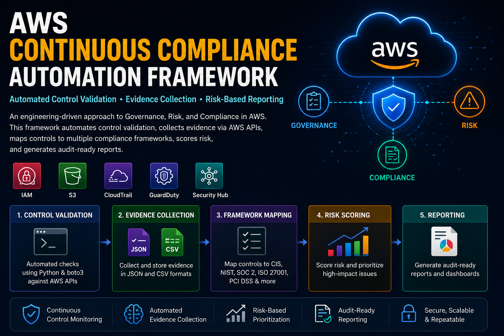
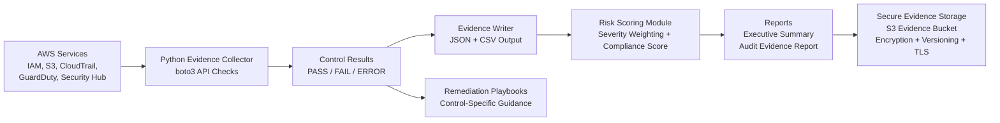
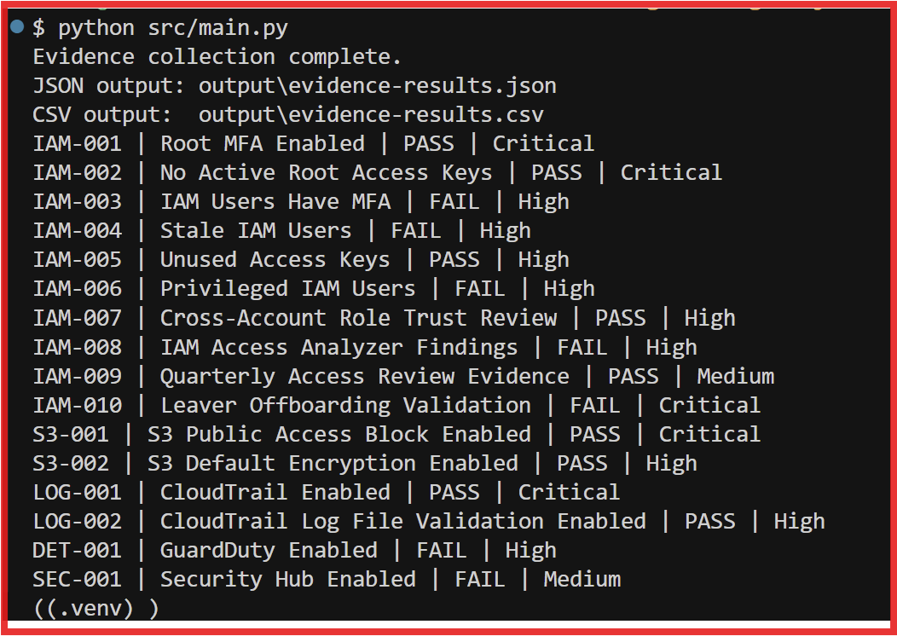
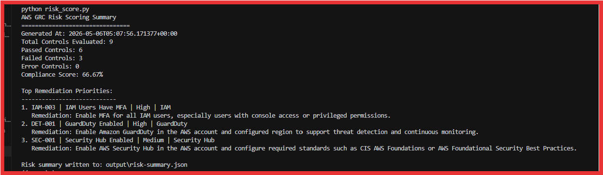

<h1 align="center">AWS Continuous Compliance Automation Framework</h1>

<p align="center">
  
</p>

An AWS GRC Engineering implementation for automated control validation, compliance evidence collection, risk-based remediation prioritization, and audit-ready reporting.


## Architecture

```text
AWS APIs → Evidence Collector → Evidence Output → Risk Scoring → Reporting → Remediation
```



## Overview

This project demonstrates an engineering-driven approach to Governance, Risk, and Compliance in AWS. It focuses on continuous control monitoring, automated evidence collection, compliance framework mapping, risk scoring, and audit-ready reporting across common AWS security domains.

The goal is to show how AWS security telemetry can be transformed into continuous compliance evidence and actionable risk insight.


## Why This Matters

Traditional compliance evidence collection often relies on screenshots, manual reviews, spreadsheets, and point-in-time audits. This approach does not scale well in dynamic cloud environments where resources and configurations can change quickly.

This project shows how AWS security controls can be validated through APIs, converted into structured evidence, mapped to compliance frameworks, scored by risk, and reported in audit-ready formats.

The result is a repeatable GRC Engineering workflow that supports continuous assurance instead of manual audit preparation.


## Business Problem

Cloud environments change quickly, but many compliance programs still rely on manual evidence collection, screenshots, spreadsheets, and point-in-time audits. This creates delays, inconsistent evidence, limited visibility, and increased risk of control drift.

## Solution

This project implements a lightweight AWS GRC Engineering workflow that:

- Defines a reusable AWS security control catalog
- Maps technical AWS controls to compliance frameworks
- Uses Python and boto3 to collect evidence from AWS APIs
- Scores findings by risk severity
- Produces audit-ready evidence outputs
- Provides remediation guidance for failed controls
- Implements a controls-as-code approach so GRC requirements are tested and evidenced automatically rather than manually

## Control Domains

- Identity and Access Management
- Logging and Monitoring
- Data Protection
- Threat Detection
- Security Posture Management

## Framework Alignment

This project includes control mapping examples for:

- CIS AWS Foundations Benchmark
- NIST Cybersecurity Framework
- NIST SP 800-53
- SOC 2 Trust Services Criteria
- ISO/IEC 27001
- PCI DSS

## Framework Coverage

| Framework | Coverage Example |
|---|---|
| CIS AWS Foundations Benchmark | Root MFA, root access keys, CloudTrail, S3 encryption, logging controls |
| NIST CSF | Identify, Protect, Detect control outcomes across IAM, logging, and monitoring |
| NIST SP 800-53 | IA, AC, AU, SC, SI, and CA control families |
| SOC 2 | CC6 and CC7 control areas for access control, monitoring, and security operations |
| ISO/IEC 27001 | Access control, logging, cryptography, operations security, and monitoring alignment |
| PCI DSS | MFA, logging, encryption, access control, and monitoring-related requirements |

## Project Status

Core implementation completed.

This project now includes:

- AWS control catalog
- Compliance framework mapping
- Automated evidence collection using Python and boto3
- IAM, S3, CloudTrail, GuardDuty, and Security Hub control checks
- JSON and CSV evidence output
- Risk scoring model
- Executive summary template
- Audit evidence report template
- Remediation playbooks
- Exception register template
- Secure S3 evidence bucket automation script

## Repository Structure

```text
aws-grc-engineering-project/
├── control-catalog/
│   ├── aws-control-catalog.csv
│   ├── framework-mapping.csv
│   └── control-testing-methodology.md
├── evidence-collector/
│   ├── config.yaml
│   ├── requirements.txt
│   └── src/
│       ├── main.py
│       ├── checks/
│       ├── evidence/
│       └── utils/
├── remediation/
│   ├── remediation-playbooks.md
│   └── exception-register-template.csv
├── reports/
│   ├── executive-summary-template.md
│   └── audit-evidence-report-template.md
├── risk-scoring/
│   ├── risk_score.py
│   └── risk-model.md
├── scripts/
│   ├── create-evidence-bucket.sh
│   └── create-evidence-bucket-with-cmk.sh
├── .gitignore
└── README.md
```

## Tech Stack

- AWS: IAM, S3, CloudTrail, GuardDuty, Security Hub
- Language: Python
- SDK: boto3
- Evidence Outputs: JSON and CSV
- Reporting: Markdown templates
- Automation: Bash scripts
- Version Control: Git and GitHub

## Implemented Controls

| Control ID | Control Name | Domain | AWS Service | Status |
|---|---|---|---|---|
| IAM-001 | Root MFA Enabled | Identity and Access Management | IAM | Implemented |
| IAM-002 | No Active Root Access Keys | Identity and Access Management | IAM | Implemented |
| IAM-003 | IAM Users Have MFA | Identity and Access Management | IAM | Implemented |
| S3-001 | S3 Public Access Block Enabled | Data Protection | S3 | Implemented |
| S3-002 | S3 Default Encryption Enabled | Data Protection | S3 | Implemented |
| LOG-001 | CloudTrail Enabled | Logging and Monitoring | CloudTrail | Implemented |
| LOG-002 | CloudTrail Log File Validation Enabled | Logging and Monitoring | CloudTrail | Implemented |
| DET-001 | GuardDuty Enabled | Threat Detection | GuardDuty | Implemented |
| SEC-001 | Security Hub Enabled | Security Posture Management | Security Hub | Implemented |

## Business Impact by Control

| Control ID | Control Name | Business Impact |
|---|---|---|
| IAM-001 | Root MFA Enabled | Reduces the risk of full account compromise through the AWS root user. |
| IAM-002 | No Active Root Access Keys | Prevents long-lived root credentials from being abused or leaked. |
| IAM-003 | IAM Users Have MFA | Reduces credential-based compromise risk for human users. |
| S3-001 | S3 Public Access Block Enabled | Helps prevent accidental public exposure of sensitive data. |
| S3-002 | S3 Default Encryption Enabled | Supports data protection requirements for encryption at rest. |
| LOG-001 | CloudTrail Enabled | Provides audit visibility into AWS API activity and administrative actions. |
| LOG-002 | CloudTrail Log File Validation Enabled | Helps prove log integrity and detect tampering with audit logs. |
| DET-001 | GuardDuty Enabled | Improves detection of suspicious activity, compromised credentials, and malicious behavior. |
| SEC-001 | Security Hub Enabled | Centralizes security posture visibility and compliance findings. |


## How to Run the Evidence Collector

From the project root:

```bash
cd evidence-collector
python -m venv .venv
source .venv/Scripts/activate
pip install -r requirements.txt
python src/main.py
```

The collector generates:

```text
output/evidence-results.json
output/evidence-results.csv
```

Raw generated evidence output is excluded from Git because it may contain AWS account-specific data such as account IDs, IAM usernames, ARNs, bucket names, and service configuration details. The sample below shows the evidence structure using sanitized values.

## Sample Evidence Output

The evidence collector generates structured JSON evidence for each control. Sensitive values are either excluded from the public repository or replaced with sample values.

```json
{
  "control_id": "IAM-003",
  "control_name": "IAM Users Have MFA",
  "control_domain": "Identity and Access Management",
  "aws_service": "IAM",
  "status": "FAIL",
  "risk_rating": "High",
  "evidence_source": "iam.list_users + iam.list_mfa_devices",
  "evidence": {
    "total_users_evaluated": 2,
    "users_without_mfa_count": 1,
    "users_without_mfa": ["sample-user"]
  },
  "remediation": "Enable MFA for all IAM users, especially users with console access or privileged permissions."
}
```

The risk scoring module converts raw control evidence into a summary that can be used by security, GRC, and control owners:

```json
{
  "total_controls_evaluated": 9,
  "passed_controls": 6,
  "failed_controls": 3,
  "error_controls": 0,
  "compliance_score_percent": 66.67,
  "top_remediation_priorities": [
    {
      "control_id": "IAM-003",
      "control_name": "IAM Users Have MFA",
      "risk_rating": "High"
    },
    {
      "control_id": "DET-001",
      "control_name": "GuardDuty Enabled",
      "risk_rating": "High"
    }
  ]
}
```


## How to Run Risk Scoring

After running the evidence collector:

```bash
cd ../risk-scoring
python risk_score.py
```

The risk scoring module generates:

```text
risk-scoring/output/risk-summary.json
```

## How to Create a Secure Evidence Bucket

This project includes a script to create a hardened S3 bucket for storing generated GRC evidence.

Default AES256 encryption:

```bash
./scripts/create-evidence-bucket-with-cmk.sh my-evidence-bucket us-east-1 grc-engineer
```

SSE-KMS with a customer-managed KMS key:

```bash
./scripts/create-evidence-bucket-with-cmk.sh my-evidence-bucket us-east-1 grc-engineer arn:aws:kms:us-east-1:123456789012:key/example-key-id
```

Strict encryption enforcement mode:

```bash
./scripts/create-evidence-bucket-with-cmk.sh my-evidence-bucket us-east-1 grc-engineer arn:aws:kms:us-east-1:123456789012:key/example-key-id strict
```

The script applies public access blocking, object ownership enforcement, versioning, encryption, TLS-only bucket policy guardrails, and project tags.


## Sample Assessment Result

Example control posture from the assessment environment:

| Metric | Value |
|---|---:|
| Total Controls Evaluated | 9 |
| Passed Controls | 6 |
| Failed Controls | 3 |
| Error Controls | 0 |
| Compliance Score | 66.67% |

Example failed controls:

| Control ID | Control Name | Risk |
|---|---|---|
| IAM-003 | IAM Users Have MFA | High |
| DET-001 | GuardDuty Enabled | High |
| SEC-001 | Security Hub Enabled | Medium |

## GRC Engineering Concepts Demonstrated

This project demonstrates:

- Continuous control monitoring
- Automated evidence collection
- Control-to-framework mapping
- Risk-based finding prioritization
- Audit-ready reporting
- Remediation playbooks
- Exception tracking
- Secure evidence storage design
- Separation of generated evidence from source code

## Security and Evidence Handling

Generated evidence files may include AWS account IDs, IAM usernames, bucket names, ARNs, and configuration details.

For that reason:

- Evidence output is excluded from version control
- Evidence should be stored in a secured S3 evidence bucket
- Access should follow least privilege
- Evidence should be encrypted at rest
- Evidence access should be logged when required by audit scope


## Phase 2 Roadmap: IAM Governance Module

Planned IAM governance controls:

- IAM-004: Stale IAM Users
- IAM-005: Unused Access Keys
- IAM-006: Privileged IAM Users
- IAM-007: Cross-Account Role Trust Review
- IAM-008: IAM Access Analyzer Findings
- IAM-009: Quarterly Access Review Evidence
- IAM-010: Leaver/Offboarding Validation

This module will extend the project from AWS control validation into identity governance by adding access review, stale access detection, privilege review, and leaver validation workflows.

## Roadmap

The current implementation uses direct AWS API calls through boto3 to perform point-in-time control validation and evidence collection. Future phases expand the framework toward continuous assurance, multi-account governance, and automated remediation.

- **AWS Config integration** — Add AWS Config managed and custom rules for continuous drift detection rather than point-in-time scans only.
- **Security Hub findings ingestion** — Ingest Security Hub findings as an additional evidence source for centralized posture management.
- **Multi-account support** — Extend evidence collection across AWS Organizations using delegated administration and cross-account role assumption.
- **Automated remediation** — Add optional Lambda-based remediation workflows for selected failed controls.
- **Dashboard reporting** — Generate HTML or dashboard-based reporting for leadership and control owners.
- **Ticketing integration** — Send failed controls to Jira or ServiceNow for remediation ownership and tracking.
- **IAM Access Analyzer checks** — Add evidence collection for public, cross-account, and external access findings.
- **KMS governance checks** — Validate key rotation, key policies, and encryption control coverage.
- **IAM Governance module** — Add stale user detection, unused access key checks, privileged user review, cross-account trust review, and quarterly access review evidence.

## Sample Screenshots

The screenshots below show the evidence collector and risk scoring module running against a dedicated AWS assessment account. Sensitive account-specific evidence is excluded from the repository; only sanitized summary output is shown.

### Evidence Collector Output



### Risk Scoring Output



## Author

Created by Uzo Bolarinwa as a practical AWS GRC Engineering implementation focused on automated control validation, compliance evidence collection, risk-based reporting, and cloud security governance.
